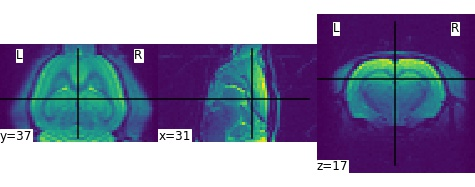
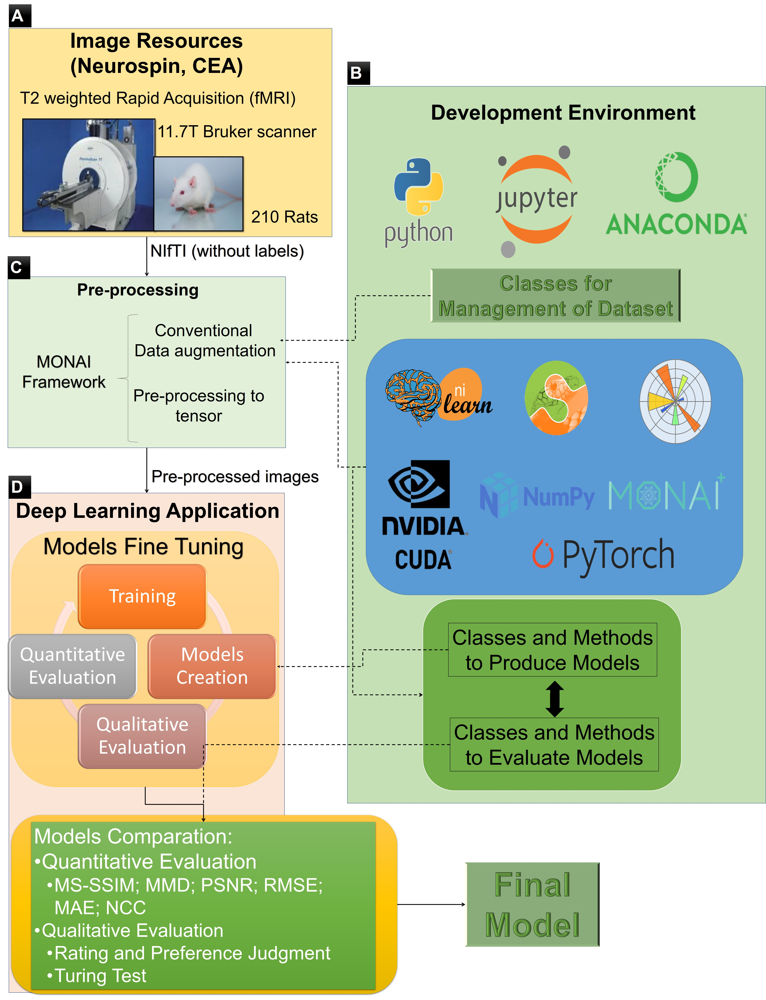
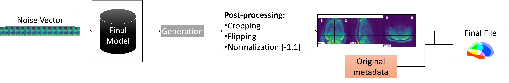
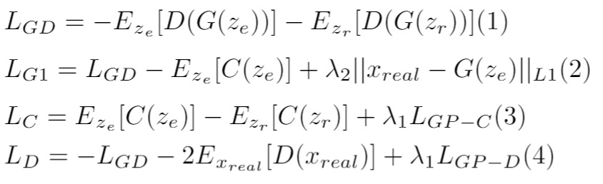
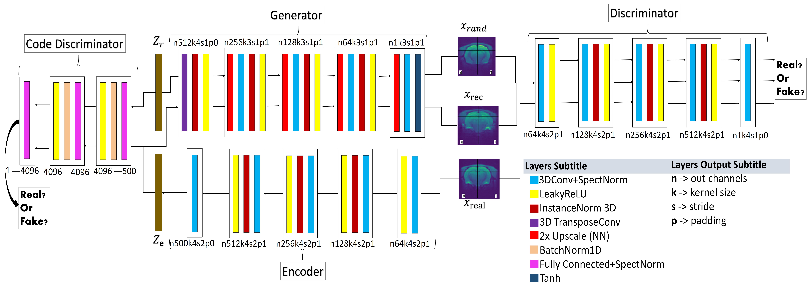
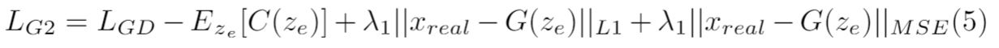
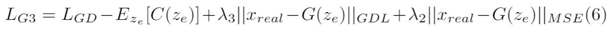
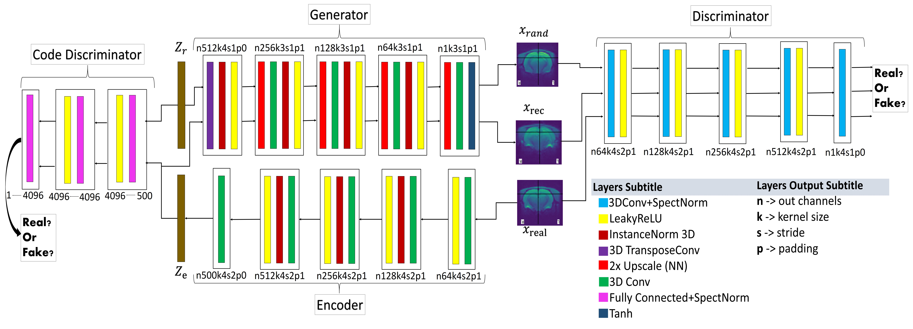

# Generation of Synthetic Rat Brain MRI scans with a 3D Enhanced Alpha-GAN


<h4>André Ferreira, Ricardo Magalhães, Sébastien Mériaux, Victor Alves
    
  <p> <li> Collaboration between Centro Algoritmi, University of Minho, Braga, Portugal and Université Paris-Saclay, CEA, CNRS, BAOBAB, NeuroSpin, 91191 Gif-sur-Yvette, France <br>
<br>
      
      
<blockquote>This project is the result of André Ferreira (a81350@alunos.uminho.pt), Victor Alves (valves@di.uminho.pt), Ricardo Magalhães (ricardo.lazarus@gmail.com) and Sébastien Mériaux (sebastien.meriaux@cea.fr) work, having been developed as part of André Ferreira's master thesis in Biomedical Engineering, Medical Informatics Branch from University of Minho. </blockquote>

    Official Pytorch Implementation of "Generation of Synthetic Rat Brain MRI scans with a 3D Enhanced Alpha-GAN"

---

## Abstract
Translational brain research using Magnetic Resonance Imaging (MRI) is becoming increasingly popular as animal models are an essential part of scientific studies and more ultra-high-field scanners are becoming available. Some disadvantages of MRI are the availability of MRI scanners and the time required for a full scanning session (it usually takes over 30 minutes). Privacy laws and the 3Rs ethics rule also make it difficult to create large datasets for training deep learning models. Generative Adversarial Networks (GANs) can perform data augmentation with higher quality than other techniques. In this work, the alpha-GAN architecture is used to test its ability to produce realistic 3D MRI scans of the rat brain. As far as the authors are aware, this is the first time that a GAN-based approach has been used for data augmentation in preclinical data. The generated scans are evaluated using various qualitative and quantitative metrics. A Turing test conducted by 4 experts has shown that the generated scans can trick almost any expert. The generated scans were also used to evaluate their impact on the performance of an existing deep learning model developed for segmenting the rat brain into white matter, grey matter and cerebrospinal fluid. The models were compared using the Dice score. The best results for whole brain and white matter segmentation were obtained when 174 real scans and 348 synthetic scans were used, with improvements of 0.0172 and 0.0129, respectively. Using 174 real scans and 87 synthetic scans resulted in improvements of 0.0038 and 0.0764 for grey matter and CSF segmentation, respectively. Thus, by using the proposed new normalisation layer and loss functions, it was possible to improve the realism of the generated rat MRI scans and it was shown that using the generated data improved the segmentation model more than using the conventional data augmentation.
      
---
      
## Materials and Methods

      
### Sigma dataset of rat brains
      
An MRI dataset of the Wistar rat brain from the Sigma project was used to test the ability of GANs to produce synthetic scans. A total of 210 scanning sessions were performed using a Bruker preclinical ultra-high field scanner (11.7 Tesla) and a 4x4 surface coil dedicated to the rat head. A T2-weighted Echo Planar Imaging sequence was implemented to acquire resting-state functional data, with a spatial resolution of 0.375mm x 0.375mm x 0.5mm over a matrix of 64x64x40, a TR of 2000ms, a TE of 17.5ms and 9 averages.  Figure 1 shows slices from three different planes (i.e. coronal, sagittal and axial) of a functional MR image of the rat brain. The dataset consists of 210 scans with a resolution of 64x64x40, which have been pre-processed to avoid complex values. For more information on the rat brain sigma dataset, see Barrière et al. (2019) or Magalhães et al. (2018). 

In this work, a different number of scans and sources (real or synthetic) were used in some steps of the experiment. Therefore, each dataset is formally defined as  D <sub>s</sub> <sup>N</sup> =  (x<sub>i</sub>, y<sub>i</sub>)<sub>i=1</sub><sup>N</sup>, where s indicates whether the scans are synthetic (s) or real (r), x the scans, y the respective labels and N the number of scans. The original sigma dataset of rat brains is formally defined as  D<sub>r</sub><sup>210</sup> =  (x<sub>i</sub>, y<sub>i</sub>)<sub>i=1</sub><sup>210</sup>.
      
      
|  |
|:--:|
| <b>Fig.1 - Example of one functional MR image from the Sigma rat brain dataset displayed in all three planes (coronal, sagittal and axial planes, respectively).</b>|
      

      
### Overall process workflow
This work was developed in Python, drawing on two important DL frameworks, PyTorch and MONAI. The specifications of the workstations are given in Table 1.
      
| Table 1 -  |    Workstation specifications                                                                                                                                                                                    |
|----------------------------------------------------------------------------------------------------------------------------------------------------------------|--------------------------------------------------------------------------------------------------------------------------------|
|     Operational system                                                                                                                                         |     Ubuntu 18.04.3   LTS (64 Bits)                                                                                             |
|     CPU                                                                                                                                                        |     Intel Xeon E5-1650                                                                                                         |
|     GPU                                                                                                                                                        |     GPU - NVIDIA   P6000     Cuda Parallel   Processing Colours 3840     GPU 24 GB   GDDR5X      FP32 performance 12 TFLOPS    |
|     Primary memory                                                                                                                                             |     64Gb                                                                                                                       |
|     Secondary memory                                                                                                                                           |     2 hard disks   with 2TB     1 hard disk   with 512Gb                                                                       |

The entire process flow of training and assessment is described in Figure 2. Figure 2-A, the Image Resources block represents the acquisition of the MRI scans and the creation of the dataset. Figure 2-B, the Development Environment block describes the development environment with all frameworks, libraries and other dependencies for training the models. Figure 2-C, the Preprocessing block corresponds to the preprocessing of the dataset (always working with the whole 3D scan), such as resizing to 64x64x64 with constant padding of zero values, intensity normalisation between -1 and 1, and some conventional data augmentation. Figure 2-D, the Deep Learning application block, is the final step where the training and evaluation of the models are done and where the best model is selected.
      
      
|  |
|:--:|
| <b>Fig.2 - Overall training and evaluation process workflow.</b>|
      
Some conventional data augmentations such as zooming, rotating, adding Gaussian noise, flipping, shifting and scaling the intensity were done as this can fill some gaps in the dataset. The size of the input random vector is an important consideration as it should be large enough to represent the dataset but not too large to avoid overfitting. Therefore, the sizes 500/1000 were tested.

The creation of the final files is the last step, shown in Figure 3. To generate a new scan, a random vector (e.g. a noise vector from a Gaussian distribution) and the final model from the training process are needed. Then the generated scan is subjected to post-processing, e.g. flipping, cropping and normalising, resulting in an image with the same properties as the original file. Finally, it is possible to generate a 3D NIfTI file from the dataset using the generated scan and metadata (headers and affines) from an original file (from the D<sub>r</sub><sup>210</sup>).      

      
|  |
|:--:|
| <b>Fig.3 - Overall generation workflow.</b>|
      
      
Eleven models were created, each trained for 200000 iterations with a stack size of 4, but only the two best and the base model for comparison are presented in this article. The first model was the baseline based on the Kwon et al. (2019) model, where generator, discriminator, encoder and code discriminator networks are identical and the latent space is of size 1000. The use of this architecture is more computationally intensive than some traditional GANs architectures because it involves four networks instead of just two. However, this choice was justified because the α-GAN architecture avoids mode collapse and fuzziness through the introduction of a VAE and a code discriminator into the GAN network. The loss functions used in this training process were (1) and (2) for generator/encoder, (3) for code discriminator and (4) for discriminator with  λ<sub>1</sub>=λ<sub>2</sub>=10 (based on the experiments of Kwon et al. (2019)):



where L<sub>GD</sub> denotes the feedback from the discriminator, D denotes the Discriminator, G denotes the Generator, C denotes the Code Discriminator, z<sub>e</sub> denotes the latent vector of the encoder, z<sub>r</sub> denotes the input random vector, x<sub>real</sub> denotes a real scan, L<sub>GP-D</sub> denotes the gradient penalty of Discriminator, L<sub>GP-C</sub> denotes the gradient penalty of Code Discriminator, L1 denotes the L1 loss function and E the total distribution. Vertical flipping was the only conventional data augmentation used to train this first model. The Adam optimizer was used with a learning rate of 0.0002, betas of 0.9, 0.999 and eps of 10<sup>-8</sup>. This architecture was called α-WGAN\_ADNI. 

The new loss functions and normalisation layer used in this work are described below. The first proposed architecture, based on Sun et al. (2020)  is shown in Figure 4 in which Spectral Normalisation (SN) was added after each convolution to stabilise the training, especially the training of the discriminator, the batch normalisation layers were replaced by instance normalisation layers to avoid some artefacts, and the activation function LeakyReLU was used instead of ReLU to speed up the training and improve the results. 
      
|  |
|:--:|
| <b>Fig.4 - α-WGANSigmaRat1 architecture. Near each layer there is a code that explains the result of each convolution, e.g., n256k3s1p1: n256, size of the output channels (in this case 256); k3, kernel size (cubic dimension 3x3x3); s1, stride (1x1x1); p1, padding (1x1x1).</b>|
      
This architecture was called αWGANSigmaRat1. The loss functions used to train this model were the same as those used for the α-WGAN\_ADNI model, except for the generator, for which a new loss function was introduced (5): 



For this training process, all previously mentioned conventional data augmentations (zoom, rotation, Gaussian noise, flip, translation and scaling intensity) as well as the Adam optimiser and a random vector size of 500 were used. 

The last proposed model architecture is shown in Figure 5. The main changes compared to the α-WGANSigmaRat1 architecture were the removal of SN after each convolution only in the generator and encoder, since in the original work by Miyato et al. (2018)  the SN was created to stabilise the training of the discriminator. The instance normalisation layers were also removed in the discriminator and in the code discriminator to avoid artefacts and reduce computational costs. In the new loss function (6), the L1 loss function was replaced by the Gradient Difference Loss (GDL) , which is described in the latest works on super-resolution:


      
|  |
|:--:|
| <b>Fig.5 - α-WGANSigmaRat2 architecture. Near each layer is displayed a code that explains the result of each convolution, e.g., n256k3s1p1: n256, size of the output channels (in this case 256); k3, kernel size (cubic dimension 3x3x3); s1, stride (1x1x1); p1, padding (1x1x1).</b>|
      
      
The loss functions used to train this model were (3) for the code discriminator, (4) for the discriminator and (6) for the generator/encoder with λ<sub>1</sub>=λ<sub>2</sub>=100 and λ<sub>3</sub>=0.01. The chosen values for  λ<sub>1</sub>, λ<sub>2</sub> and λ<sub>3</sub> proved to be more stable than other values after some experimental tests.

All conventional data augmentations were performed, the size of the input random vector was 500, and a new optimiser was used, AdamW with a learning rate of 0.0002, betas of 0.9, 0.999, eps of 10<sup>-8</sup> and a weight decay of 0.01. The AdamW is known to have a more stable weight decay than the Adam. This architecture was named α-WGANSigmaRat2.

The difference between the synthesis of rat and human MRI brains is the resolution of the input scans. Here, scans with a resolution of 64x64x40 were used, but nowadays (with the arrival of better GPUs) it is possible to process scans with higher resolutions (e.g. 256x256x256). Since an alpha-GAN architecture with new loss functions and a special normalisation (SN) is used, the training can be performed with human MRI scans without much difference, except for the longer runtime.
      
      
## Citation
If you find our research useful, please cite our work.
```  
@article{ferreira2022generation,
  title={Generation of Synthetic Rat Brain MRI Scans with a 3D Enhanced Alpha Generative Adversarial Network},
  author={Ferreira, Andr{\'e} and Magalh{\~a}es, Ricardo and M{\'e}riaux, S{\'e}bastien and Alves, Victor},
  journal={Applied Sciences},
  volume={12},
  number={10},
  pages={4844},
  year={2022},
  publisher={MDPI}
}
```  
